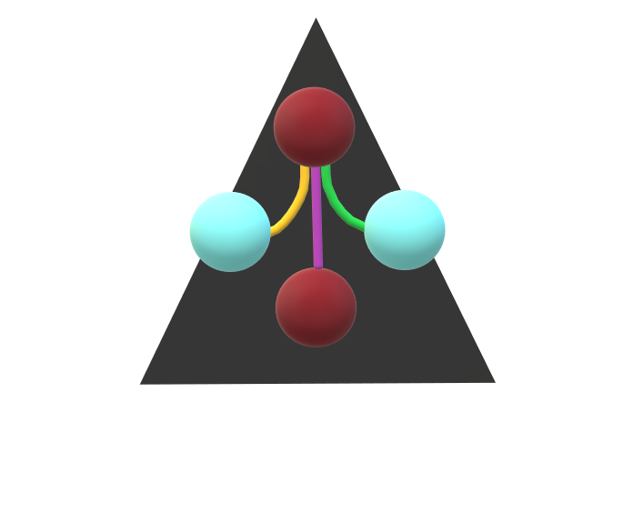

# Development of a Cytoscape App for microbe-microbe association networks                                                           

### GitHub Repository : [MGG](https://github.com/ermismd/MGG/tree/MGG)

## Summary

The Microbetag GUI (MGG) is a graphical user interface for [microbetag](https://github.com/hariszaf/microbetag) tool, which infers microbial interactions and increases the confidence level of co-occurrence networks edges through metabolic network analysis and data integration. The GUI provides an intuitive interface for users to input their data, configure parameters, and visualize results.

It will facilitate the visualization and exploration of annotated microbial networks generated by microbetag. The app will be modeled after the successful [scNetViz](https://github.com/RBVI/scNetViz).

In these GH pages, the progress of the development will be periodically updated.


 * * *
 
 
 
## Preparation/Bonding Period<br><br>

* Understanding StringApp, scNetViz
* Finalized GitHub pages for the GSoC project
* Set Up the Environment
* Created mock apps for training using OSGI services and Maven
* Communication with the Mentors


* * *


## Coding Period

#### Coding Period : [Commits](https://github.com/RBVI/scNetViz/compare/master...ermismd:MGG:MGG)

### Week 1 & 2

1. Forked scNetViz and Renamed to MGG: Took the existing scNetViz repository and renamed it to MGG, followed by a thorough refactoring of the application.
2. Launched New GitHub Pages: Established a GitHub Pages site to document and track the project's progress in real-time.
3. Created two foundational classes: ImportFileTask and ImportFileTaskFactory.
                         -Capable of loading and reading data in CSV/TSV formats directly into Cytoscape.
   
  - [More Info](./another-page.html)

  - [Related Commits](https://github.com/RBVI/scNetViz/commit/db42c09453aa27b292f00e7c54070fe8d5332d59)

### Week 3 & 4

1. Implemented MGGManager.java: Will serve as a central hub for registering task factories and facilitate the passing of variables between different components.
2. Added Menu Icons to Cytopanel {North}: Enhanced the user interface by introducing icons for file import operations, making the application more intuitive to use.
3. Integrated @Tunables Annotation: Allows for dynamic configuration by enabling users to add variables directly to the OTU/ASV table during the file import process via ImportFileTask.

### Week 5 & 6

1. Integrated Task Factories into CyActivator: Added task factory class into the CyActivator.
2. Enhanced ImportFileTask for JSON Parsing: Upgraded the ImportFileTask class to be capable of parsing data as JSON objects, thereby expanding the range of supported data formats.
3. Developed MGGManager as a Central Hub:
          -Implemented a mock version of the MGGManager class.
          -Positioned MGGManager as the core hub for task factory registration and as an intermediary for variable transfer between different components of the application.
   
### Week 7 & 8

1. Upgraded MGGManager for Task Instantiation and Data Handling:
2. Enhanced the MGGManager.java to not only instantiate ImportFileTask but also to retrieve and save JSON objects that are processed by ImportFileTask.
3. Advanced Features in ImportFileTask:
          -Made multiple improvements including the addition of annotations for 'Tunable' parameters and the incorporation of new menu actions to improve usability.
4. Introduced JsonDisplayPanel for Data Visualization:
          -Developed a new class, JsonDisplayPanel, specifically designed to display imported data tables such as OTU and ASV in a user-friendly manner.
   
    - [More Info](./anotherpage2.html)

### Week 9 & 10

1. ImportFileTask: Further updated.
2. SendDataToServerTask: Created  class for the server interaction and data exchange.
3. SendDataToServerTaskFactory: A factory class  for  instantiation and management of SendDataToServerTask.
4. MGGManager: The class was updated to activate the task factory for SendDataToServerTask.
   
    - [More Info](./anotherpage3.html)

### Week 11 & 12

1. Optimized Server Interaction with SendDataToServerTask:
               -Streamlined SendDataToServerTask to include configuration settings that manage remote host response time and connection establishment.
2. Laid the Groundwork for Cytopanel with New Classes:
               -Introduced two new classes, AbstractMGGPanel and EasyGBC, aimed at facilitating the later creation of a Cytopanel.
Enhanced Task Monitoring and Feedback:
               -Incorporated status messages into TaskMonitor to provide real-time updates and included messages to confirm successful server interactions.

### Week 13 & 14

1. CreateNetworkTask: Created a class that accepts the response table from the SendDataToServerTask and is responsible for parsing the table and constructing a network model based on it.
                      - Additionally, the class generates a visual style for the nodes and edges of the network.    
2. CreateNetworkTaskFactory: A factory class for instantiation of the the CreateNetworkTask.
3. Code Refinement: All previously implemented classes have undergone revisions to improve their coherence and streamline their functionalities, thus enhancing the overall codebase quality.


     - [More Info](./anotherpage4.html)

     - [Related Commits](https://github.com/RBVI/scNetViz/commit/1e06678e46d6dedec223a5714d533d5770ba5ab8#diff-9491bb1e545b78a6eda3250e035a553530373b639abf4da66afefe5def3c25d9L15)


### Week 15 & 16

1. Developed JsonResultPanel for Enhanced UI:
                    -Created JsonResultPanel to wrap JsonDisplayPanel and integrate it into the Cytopanel component on the east side. 
2. Structured the Cytopanel with MGGCytoPanel:
                    -Introduced MGGCytoPanel, a new class designed to structure the Cytopanel component on the east side. This class includes two separate panels for nodes and edges.
3. Implemented Data Filtering in AbstractMGGPanel:
                    -Incorporated foundational code into AbstractMGGPanel for filters based on the "flashweave-score", supporting continuous value ranges. For data visualization and analysis.
4. Enhanced Network Identification in MGGCytoPanel:
                    -Added code to MGGCytoPanel that checks if a given network is an annotated microbetag network. Depending on the result, the panel is either displayed or hidden.

    - [More Info](./anotherpage5.html)

### Week 17 & 18

1. MGGEdgePanel: The Hub for Edge-Related Data
                  -The MGGEdgePanel serves as a dedicated sub-component within MGGCytoPanel to display edge-related information.  
2. ShowResultsPanel and ShowResultsTaskFactory: Dynamic Data Presentation
                   -The ShowResultsPanel and its corresponding ShowResultsTaskFactory work hand-in-hand to inspect the current network and dynamically supply data to both MGGEdgePanel and MGGCytoPanel. 


      - [More Info](./anotherpage6.html)

      - [Related Commits](https://github.com/RBVI/scNetViz/commit/2fd07e680db477e9c6fc8d7348ee29aeb6937e48)

   
* * *

||

* * *


```
End
```
